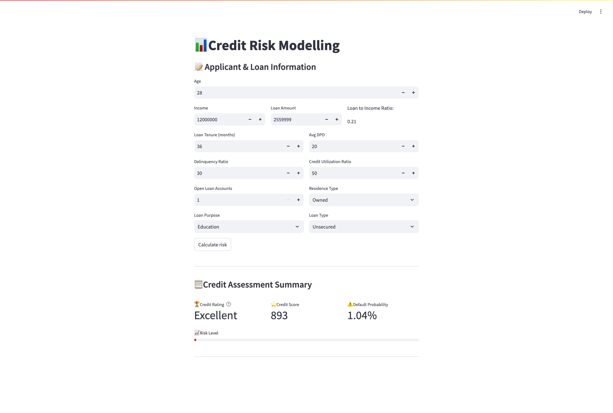

# Credit-Risk-Modelling

A machine learning-powered **credit risk modeling application** that predicts an individual's **default probability**, computes a standardized **credit score (300–900)**, and assigns a **credit rating** based on financial and demographic data.

Built using **scikit-learn** for modeling, **Streamlit** for the interactive frontend,and **FastAPI** for backend API. The application supports real-time risk assessment that financial institutions can integrate into their decision systems.


##  Project Overview


The application uses a trained **logistic regression model** to:
- Predict the likelihood of credit default
- Compute a credit score scaled from **300 to 900**
- Categorize the applicant into **Poor / Average / Good / Excellent**

Inputs such as age, income, loan amount, credit utilization, etc., are passed through an API built with FastAPI to receive real-time scoring..

##  Features

-  Real-time prediction of **default probability**
-  Modular FastAPI backend for easy deployment
-  Dockerized backend for cloud deployment (AWS EC2)
-  Calculation of standardized **credit score (300–900 scale)**
-  Assignment of **credit rating** (Poor/Average/Good/Excellent)
-  Clean, intuitive **Streamlit UI**
-  Dynamic computation of derived metrics like **Loan-to-Income Ratio**

##  Dataset Information  

This dataset contains **50,000 loan applicants' records**, including demographic details, financial status, loan details, and credit history. The data is structured with **33 columns**, providing insights into factors influencing credit risk assessment.  

#### **Key Features:**  
- **Customer Information:** `cust_id`, `age`, `gender`, `marital_status`, `employment_status`, `income`, `number_of_dependants`  
- **Residence & Location:** `residence_type`, `years_at_current_address`, `city`, `state`, `zipcode`  
- **Loan Details:** `loan_id`, `loan_purpose`, `loan_type`, `sanction_amount`, `loan_amount`, `processing_fee`, `gst`, `net_disbursement`, `loan_tenure_months`, `principal_outstanding`  
- **Financial Status:** `bank_balance_at_application`, `number_of_open_accounts`, `number_of_closed_accounts`, `credit_utilization_ratio`, `enquiry_count`  
- **Repayment History:** `disbursal_date`, `installment_start_dt`, `total_loan_months`, `delinquent_months`, `total_dpd`  

🔹 **Target Variable:** `default` (boolean) indicates whether a customer defaulted on the loan.  

This dataset is useful for building **credit risk models**, loan approval systems, and financial analytics applications. 

##  Project Setup  
### 1. Clone the Repository  
```bash
git clone https://github.com/neethu-codes/Credit-Risk-Modelling.git
cd Credit-Risk-Modelling
```
### 2. Create and Activate Virtual Environment
```bash
python -m venv venv  
source venv/bin/activate  # On Mac/Linux  
venv\Scripts\activate  # On Windows  
```
### 3. Install Dependencies
```bash
pip install -r requirements.txt 
```
### 4. Run the Streamlit App
```bash
streamlit run main.py
```
## Project Structure
```
credit-risk-modelling/
 
├── main.py # Streamlit application
├── prediction_helper.py # Function to load and run the model
│── artifacts/
│ ├── model.joblib # Pre-trained model 
│── requirements.txt # Dependencies
│── README.md # Project documentation
│── Dockerfile # Container setup for FastAPI app
```

## Run With Docker

```bash
docker pull msneethu/credit-risk-api
docker run -d -p 8000:8000 msneethu/credit-risk-api
```
Open API docs at: http://localhost:8000/docs

## Deploy to AWS EC2 (Steps)
### 1. Launch EC2 (Ubuntu) instance

### 2. Install Docker:


```
sudo apt update && sudo apt install docker.io -y
sudo systemctl start docker
sudo systemctl enable docker
sudo usermod -aG docker $USER
```

### 3. Pull and run your container:


```
docker pull msneethu/credit-risk-api
docker run -d -p 8000:8000 msneethu/credit-risk-api
```

### 4. Open port 8000 in your EC2 security group

### 5. Access at http://EC2-Public-IP:8000/docs

## App Preview
Here’s a preview of the application:

